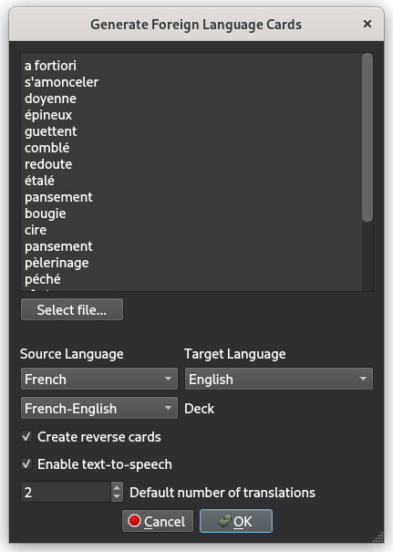
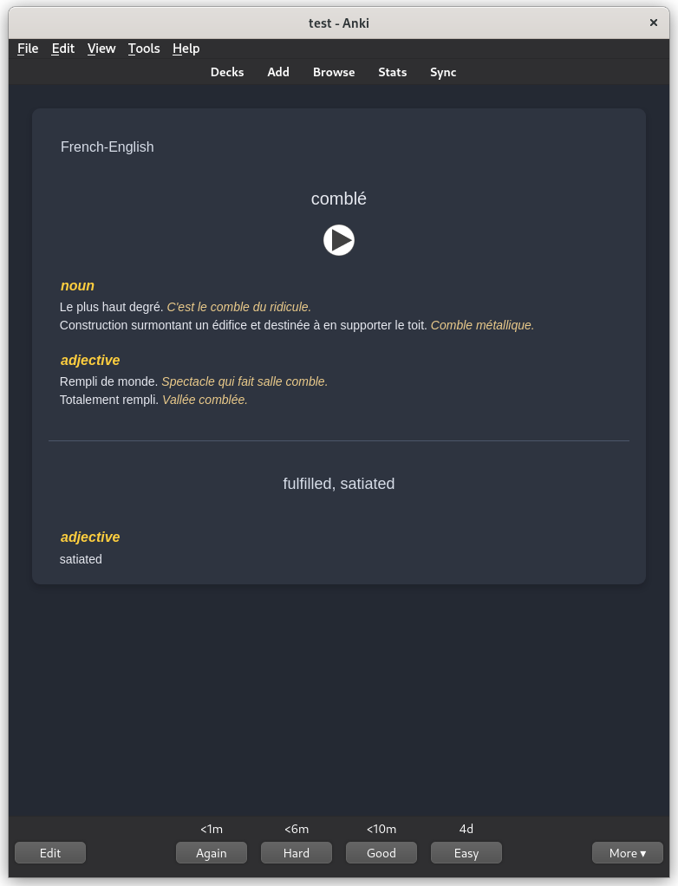
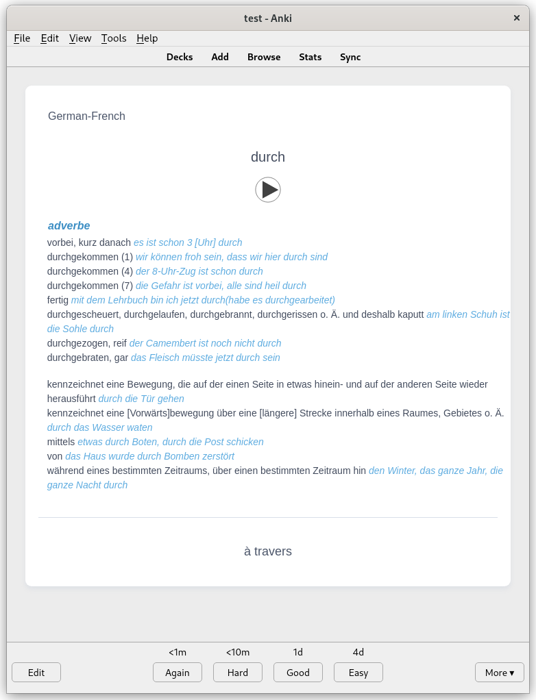

## anki-card-builder
</img></img></img>

Quick and easy foreign vocabularly card generation for `anki`.

### Intro
Tired of needing to look up and manually make flash cards for foreign language study? It can quickly add up to hours when creating so many cards... 

`anki-card-builder` can generate all those cards for you, with beautifully styled and formatted notes with extra useful information and text-to-speech to help you internalize the sounds of your target language. Generate reverse cards automatically to help establish a two way association with each word and its meaning. Just throw the words you want to learn into a text file or directly into the interface and cards will be generated and added to a deck. `anki-card-builder` uses the `googletrans` and `gTTS` python packages to translate your words and generate text-to-speech, so the process is totally free and doesn't require any premium API keys. 

### Installation
If you want to install the plugin manually just clone the repo, navigate to the scripts directory and run
`./install_deps.sh && ./package.sh`
You can use the resulting `anki-card-builder.ankiaddon` file to install the addon.

### Acknowledgements
This addon was heavily inspired by [mnemocards](https://github.com/guiferviz/mnemocards) (especially the card format). `mnemocards` is great if you want some more advanced features but it comes with an unnecessary 3 minute pause after every 25 cards that can make very large vocab sets take a long long time to generate. It also generates .apkg files that have to be separately imported into `anki` and a command line tool with json configuration isn't convenient for most users. I wanted to make something that can be used directly from `anki` and is focused on just quickly generating vocab cards to help accelerate language learning.

I also want to give credit to [anki-prettify](https://github.com/pranavdeshai/anki-prettify) for the base card format I extended for vocabulary. The note type responds to system theme and is responsive to screen size so it displays really nicely on mobile. I also tried to make the card format as easily human editable as possible without relying on embedded html in the card fields for styling (with one small exception) so you should be able to quickly update any cards that `googletrans` produces questionable translations for.
